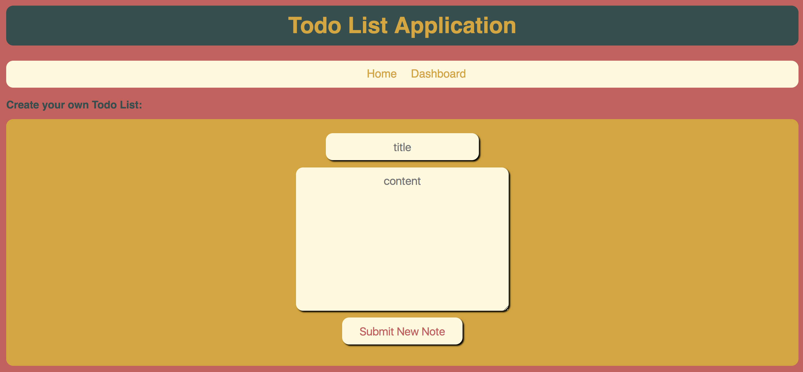

# Code Fellows: Seattle 401 JavaScript - 401d19

## Lab 28: Todo List

### Author: 
Catherine Looper

### Motivation

In this project, I built a frontend Todo List application containing a Home Page with a brief description about the application, and a Dashboard page where users can create their own Todo List. To create a Todo List, users can enter a note title and description and click `Submit New Note`. Users also have the ability to remove any of their created notes by clicking the `Delete` button next to the note they would like to remove. 

In this application, I configured webpack to compile JavaScript and SASS into a bundle and configured babel to transpile JSX and ES6 to ES5 JavaScript. I was able to create and render React components to the DOM, add event listeners to React components, and update React component state.

### Build

#### Sample Note:

### Limitations

To use this app - it is assumed that the user has familiarity with the tech and frameworks listed below.

### Code Style

Standard JavaScript with ES6, SASS, CSS, HTML

### Tech/Framework Used

* babel-core
* babel-loader
* babel-plugin-transform-object-rest-spread
* babel-preset-env
* babel-preset-react
* css-loader
* eslint-plugin-react
* extract-text-webpack-plugin
* html-webpack-plugin
* node-sass
* react
* react-dom
* react-router-dom
* resolve-url-loader
* sass-loader
* superagent
* uuid
* webpack
* webpack-dev-server
* eslint
* enzyme
* enzyme-adapter-react-16
* jest

### How to use?

* Step 1. Fork and Clone the Repository.
* Step 2. `npm install`
* Step 3. `npm run watch`
* Step 4. You should now be able to visit: `http://localhost:8080/` to view the application
* Step 5. The loading/home page will be displayed - to access the Todo list - click on the nav bar item `Dashboard`.
* Step 6. To create a new note, enter a title and a description and click the `Submit New Note` button. 
* Step 7. Notes can be removed by clicking the corresponding `Delete` button.

### Credits

* Code Fellows

### License

MIT © Catherine Looper

